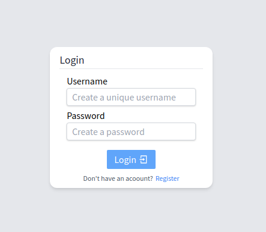
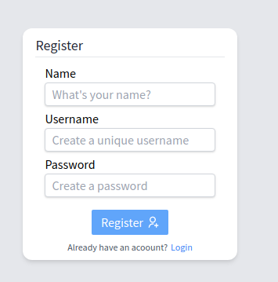
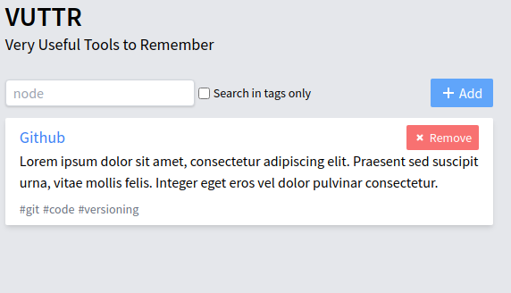
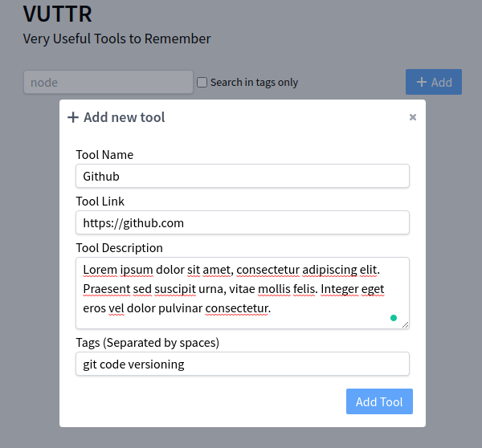
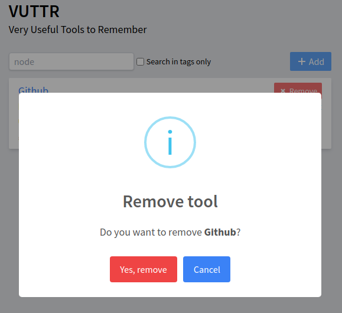

# VUTTR

Projeto com o intuito de disponibilizar uma aplicação React.JS para gerenciando de links de ferramentas úteis, também conhecido com **VUTTR** *(Very Useful Tools To Remember)*

Disponível em: https://vuttr.paulokramer.com/

## Linguagem e Tecnologias
- React.JS
- TailwindCSS
- Typescript

## Ferramentas
- VSCode

## Aplicação
### Visão Geral
A aplicação VUTTR permite que você se registre/faça login e acesse uma tela autenticada para gerenciar sua ferramentas, podendo listar, buscar, adicionar novas ou remover.

Existem dois grupos de telas, as autenticadas (listagem e formulários de ferramentas) e as não autenticadas (login e registro).

### Funcionalidades

**Autenticação**

É possível se registrar na aplicação e realizar o login para acessar as áreas autenticadas.

Informações:
- Nome
- Usuário
- Senha

**Funcionalidades**

Após efetuar o login, é possível acessar a tela de ferramentas, nessa tela possuimos as seguintes funções:
- **Listagem**: Exibe todas as ferramentas criadas para o nosso usuário.

- **Filtrar:** É possível filtrar as ferramentas através do campo texto na parte superior esquerda e definir a busca por tags através do checkbox na mesma posição. 
- **Adicionar Ferramentas:** Podemos adicionar novas ferramentas, clicando no botão "Add" no canto superior direito, após clicar nele, abrirá-se um modal para preenchermos as informações da ferramenta.

- **Excluir:** Para excluir ferramentas, basta procurar o botão vermelho escrito "Remove" na repectiva ferramenta que vecê deseja remover, após confirmar a exclusão o sistema atualizará a listagem.

## Instalação

### Requisitos
- NPM

## Passo a Passo
- Clone o projeto `git clone https://github.com/PauloAK/vuttr.git`
- Acesse a pasta do frontend `cd vuttr/frontend/`
- Instale as dependências do node `npm install`
- Após a instalação ter sido realizada, verifique se a aplicação backend já está rodando e respondendo em: `127.0.0.1:3000`
- Se já estiver sendo executado, podemos iniciar a nossa aplicação React através do comando: `npm start` (Como estamos rodando nosso servidor da API na porta `3000`, o comando perguntará se queremos executar nossa aplicação em outra porta, basta responder que sim e o comando já direcionará pra outra porta, geralmente `3001`)
- Pronto! A Aplicação já está disponível em `http://127.0.0.1:3001` (Provavelmente o comando npm start já irá abrir uma aba com o endereço para você automaticamente)
